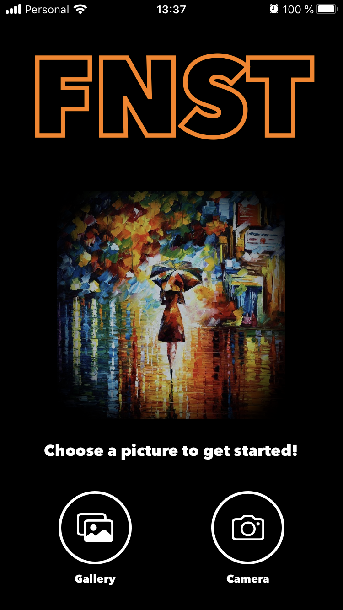
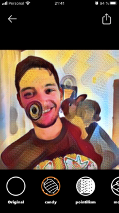
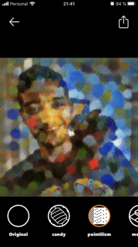
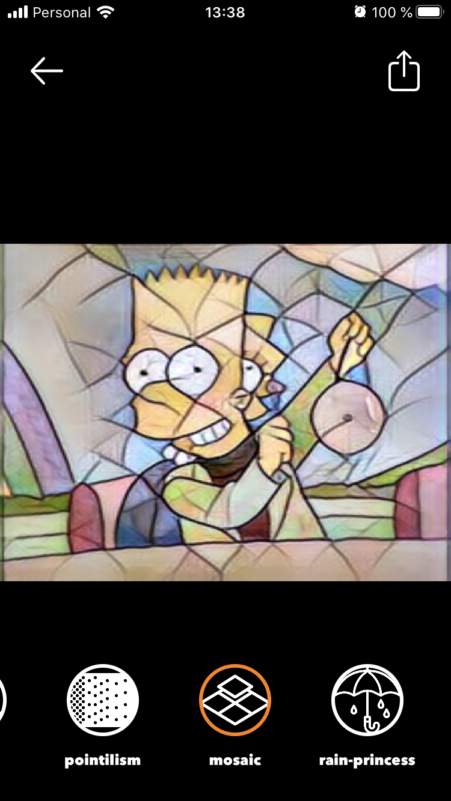
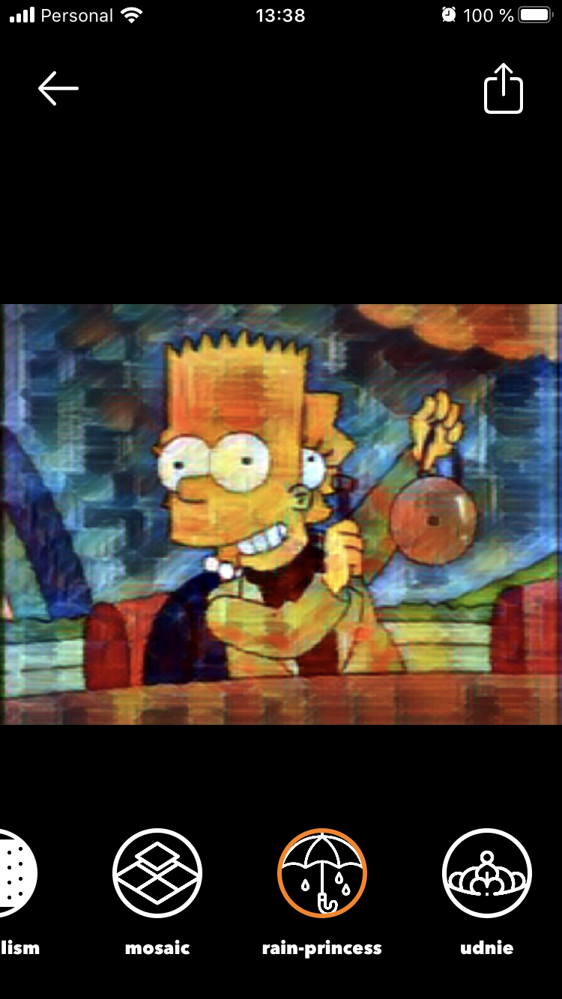
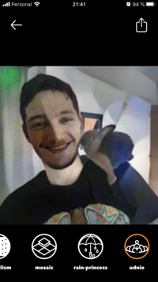
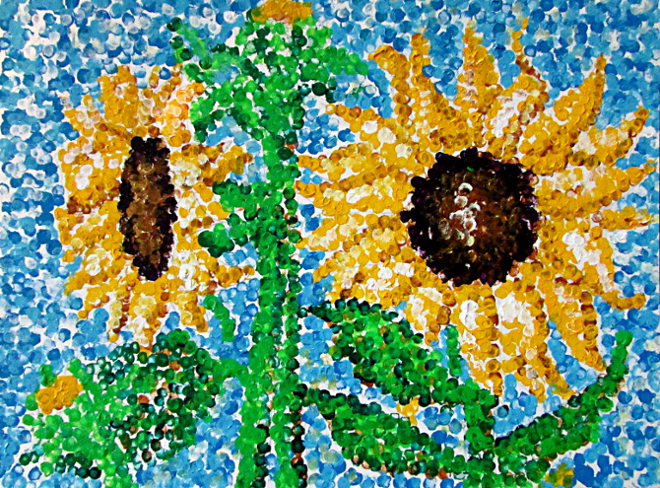

# Mobile FNST

## Mobile Fast Neural Style Transfer

This application was built using the [ONNX pretrained models](https://github.com/onnx/models/tree/master/vision/style_transfer/fast_neural_style). These ONNX models were converted to *iOS 12 compatible* CoreML models (using OpSet 8), and then copied in compile time to the application bundle. This process can be found in the [scripts](scripts).

The application was made using UIKit with MVC Arch, as it's very simple.

These are some screenshots from the app:

| Main Screen | Candy | Pointilism |
| --- | --- | --- |
|  |  |  |

| Mosaic | Rain Princess | Udnie |
| --- | --- | --- |
|  |  |  |

These are the styles:

| Candy | Pointilism | Mosaic | Rain Princess | Udnie |
| --- | --- | --- | --- | --- |
|  |  |  |  |  |

### Run

First, we need to run the script: `scripts/models.sh` which downloads and converts the models to *CoreML*. And that's it! Open the .xcodeproj in XCode and run!

### Acknowledgements

- [ONNX Model ZOO](https://github.com/onnx/models/tree/master/vision/style_transfer/fast_neural_style)
- [Pytorch Original Style Transfer Model](https://github.com/onnx/models/tree/master/vision/style_transfer/fast_neural_style)
- [CoreML Helpers](https://github.com/hollance/CoreMLHelpers)

### LICENSE

BSD-3-Clause (as the ONNX Model Zoo)
